# Profile Trophy Action

[](https://github.com/soulteary/github-profile-trophy-action)

## Languages / 语言 / Sprachen / Lingue / 언어 / 言語

- [English](README.md)
- [简体中文](README.zh.md)
- [Deutsch](README.de.md)
- [Italiano](README.it.md)
- [한국어](README.kr.md)
- [日本語](README.ja.md)

GitHub Actions ワークフローで [GitHub Profile Trophy](https://github.com/soulteary/github-profile-trophy) カードを生成し、プロフィールリポジトリにコミットして、そこから直接埋め込みます。

この Action は `github-profile-trophy` サービスの Go 実装を使用し、GitHub Releases から事前コンパイルされたバイナリをダウンロードし、CLI 経由で呼び出してトロフィーカードを生成します。

## クイックスタート

```yaml
name: Update README trophy

on:
  schedule:
    - cron: "0 0 * * *" # 毎日深夜に1回実行
  workflow_dispatch:

jobs:
  build:
    runs-on: ubuntu-latest

    permissions:
      contents: write

    steps:
      - uses: actions/checkout@v4

      - name: Generate trophy card
        uses: soulteary/github-profile-trophy-action@v1.0.0
        with:
          options: 'username=${{ github.repository_owner }}&theme=gruvbox&column=7&margin-w=15&margin-h=15'
          path: profile/trophy.svg
          token: ${{ secrets.GITHUB_TOKEN }}

      - name: Commit trophy card
        run: |
          git config user.name "github-actions[bot]"
          git config user.email "41898282+github-actions[bot]@users.noreply.github.com"
          git add profile/trophy.svg
          git commit -m "Update README trophy" || exit 0
          git push
```

次に、プロフィール README から埋め込みます:

```md

```

## デプロイオプション

この action は推奨されるデプロイオプションの1つです。Vercel やその他のプラットフォームでもデプロイできます。[GitHub Profile Trophy README](https://github.com/soulteary/github-profile-trophy#deploy-on-your-own) を参照してください。

## 入力

- `options`: クエリ文字列(`key=value&...`)または JSON 形式のトロフィーカードオプション。`username` が省略された場合、action はリポジトリ所有者を使用します。
- `path`: SVG ファイルの出力パス。デフォルト: `profile/trophy.svg`。
- `token`: GitHub トークン(PAT または `GITHUB_TOKEN`)。プライベートリポジトリの統計の場合、`repo` および `read:user` スコープを持つ [PAT](https://docs.github.com/en/authentication/keeping-your-account-and-data-secure/managing-your-personal-access-tokens) を使用してください。
- `version`: 使用する github-profile-trophy バイナリのバージョン(例: `v1.0.0`)。デフォルト: `v1.0.0`。最新バージョンを取得するには `latest` を使用します。
- `repo`: `owner/repo` 形式の GitHub リポジトリ。デフォルト: `soulteary/github-profile-trophy`。

## 出力

- `path`: SVG ファイルが書き込まれたパス。

## オプションパラメータ

`options` 入力は次のパラメータを受け入れます:

- `username` (必須) - GitHub ユーザー名
- `theme` - テーマ名 (デフォルト: "default")
- `column` - 最大列数 (デフォルト: 8, `-1` 使用で適応的)
- `row` - 最大行数 (デフォルト: 3)
- `margin-w` - トロフィー間の水平マージン (デフォルト: 0)
- `margin-h` - トロフィー間の垂直マージン (デフォルト: 0)
- `title` - トロフィータイトルでフィルタリング (カンマ区切り, `-` プレフィックスで除外)
- `rank` - ランクでフィルタリング (カンマ区切り, `-` プレフィックスで除外)
- `no-bg` - 透明背景 (デフォルト: false)
- `no-frame` - フレームを非表示 (デフォルト: false)

## 📖 使用例

### 基本トロフィーカード

```yaml
- name: Generate trophy card
  uses: soulteary/github-profile-trophy-action@v1.0.0
  with:
    options: 'username=${{ github.repository_owner }}'
    path: .github/assets/trophy.svg
    token: ${{ secrets.GITHUB_TOKEN }}
```


### テーマ付き

```yaml
- name: Generate trophy card
  uses: soulteary/github-profile-trophy-action@v1.0.0
  with:
    options: 'username=${{ github.repository_owner }}&theme=onedark'
    path: .github/assets/trophy.svg
    token: ${{ secrets.GITHUB_TOKEN }}
```


### タイトルでフィルタリング

```yaml
- name: Generate trophy card
  uses: soulteary/github-profile-trophy-action@v1.0.0
  with:
    options: 'username=${{ github.repository_owner }}&title=Stars,Followers'
    path: .github/assets/trophy.svg
    token: ${{ secrets.GITHUB_TOKEN }}
```


### ランクでフィルタリング

```yaml
- name: Generate trophy card
  uses: soulteary/github-profile-trophy-action@v1.0.0
  with:
    options: 'username=${{ github.repository_owner }}&rank=S,AAA'
    path: .github/assets/trophy.svg
    token: ${{ secrets.GITHUB_TOKEN }}
```


### カスタムレイアウト

```yaml
- name: Generate trophy card
  uses: soulteary/github-profile-trophy-action@v1.0.0
  with:
    options: 'username=${{ github.repository_owner }}&column=3&row=2&margin-w=15&margin-h=15'
    path: .github/assets/trophy.svg
    token: ${{ secrets.GITHUB_TOKEN }}
```


### 透明背景

```yaml
- name: Generate trophy card
  uses: soulteary/github-profile-trophy-action@v1.0.0
  with:
    options: 'username=${{ github.repository_owner }}&theme=gruvbox&no-bg=true&no-frame=true'
    path: .github/assets/trophy.svg
    token: ${{ secrets.GITHUB_TOKEN }}
```

### JSON オプション

```yaml
- name: Generate trophy card
  uses: soulteary/github-profile-trophy-action@v1.0.0
  with:
    options: '{"username":"${{ github.repository_owner }}","theme":"gruvbox","column":7,"margin-w":15,"margin-h":15}'
    path: .github/assets/trophy.svg
    token: ${{ secrets.GITHUB_TOKEN }}
```

### バージョン指定

```yaml
- name: Generate trophy card
  uses: soulteary/github-profile-trophy-action@v1.0.0
  with:
    options: 'username=${{ github.repository_owner }}&theme=gruvbox'
    path: profile/trophy.svg
    token: ${{ secrets.GITHUB_TOKEN }}
    version: v1.0.0  # 特定のバージョンを使用
    # version: latest  # または最新バージョンを使用
```

## 🎨 利用可能なテーマ

20以上の美しいテーマから選択できます！元のプロジェクトのすべてのテーマがサポートされています。

<details>
<summary>すべてのテーマを表示するにはクリック</summary>

### default


### flat


### onedark


### gruvbox


### dracula


### monokai


### chalk


### nord


### alduin


### darkhub


### juicyfresh


### oldie


### buddhism


### radical


### onestar


### discord


### algolia


### gitdimmed


### tokyonight


### matrix


### apprentice


### dark_dimmed


### dark_lover


### kimbie_dark


### aura


</details>

## トロフィータイプ

### 基本トロフィー
- Stars, Commits, Followers, Issues, Pull Requests, Repositories, Reviews

### シークレットトロフィー
- MultiLanguage (10+ 言語)
- AllSuperRank (すべての基本トロフィーが S ランク以上)
- LongTimeUser (10+ 年)
- AncientUser (2010年以前)
- OGUser (2008年以前)
- Joined2020 (2020年に参加)
- Organizations (3+ 組織)
- Experience (アカウント期間)

## ランクシステム

ランクは次のとおりです: `SECRET`, `SSS`, `SS`, `S`, `AAA`, `AA`, `A`, `B`, `C`, `UNKNOWN`

## 動作方法

この action は次のように動作します:

1. **プラットフォーム検出**: オペレーティングシステム(Linux/macOS)とアーキテクチャ(amd64/arm64)を自動検出
2. **バイナリダウンロード**: 指定されたバージョンの GitHub Releases から事前コンパイルされたバイナリをダウンロード
3. **CLI 呼び出し**: 提供されたオプションで Go バイナリの CLI モードを呼び出し
4. **ファイル保存**: 生成された SVG を指定されたパスに書き込み

## オリジナルバージョンとの違い

| 機能 | オリジナルバージョン | このバージョン |
|------|-------------------|--------------|
| 実装 | Node.js | Bash |
| サービス呼び出し | 直接ライブラリ関数呼び出し | Go バイナリへの CLI 呼び出し |
| 依存関係 | Node.js + npm パッケージ | curl(事前インストール済み) |
| ビルド | npm install | Releases からダウンロード |
| バイナリソース | npm パッケージ | GitHub Releases |

## サポートプラットフォーム

- Linux (amd64, arm64)
- macOS (amd64, arm64)

Action は自動的に runner のプラットフォームを検出し、適切なバイナリをダウンロードします。

## 注意事項

- この action は [soulteary/github-profile-trophy](https://github.com/soulteary/github-profile-trophy) と同じレンダラーとフェッチャーを使用します。
- Go 環境は不要です - バイナリは事前コンパイルされ、Releases からダウンロードされます。
- サービスバイナリは action 実行中に一時的にダウンロードされ実行されます。
- 最高のパフォーマンスを得るには、API 呼び出しを避けるために `latest` の代わりにバージョンを指定してください。

## ライセンス

MIT License
