# Profile Trophy Action

[](https://github.com/soulteary/github-profile-trophy-action)

## Languages / 语言 / Sprachen / Lingue / 언어 / 言語

- [English](README.md)
- [简体中文](README.zh.md)
- [Deutsch](README.de.md)
- [Italiano](README.it.md)
- [한국어](README.kr.md)
- [日本語](README.ja.md)

GitHub Actions 워크플로우에서 [GitHub Profile Trophy](https://github.com/soulteary/github-profile-trophy) 카드를 생성하고, 프로필 저장소에 커밋한 다음, 거기서 직접 임베드합니다.

이 Action은 `github-profile-trophy` 서비스의 Go 구현을 사용하며, GitHub Releases에서 사전 컴파일된 바이너리를 다운로드하고 CLI를 통해 호출하여 트로피 카드를 생성합니다.

## 빠른 시작

```yaml
name: Update README trophy

on:
  schedule:
    - cron: "0 0 * * *" # 매일 자정에 한 번 실행
  workflow_dispatch:

jobs:
  build:
    runs-on: ubuntu-latest

    permissions:
      contents: write

    steps:
      - uses: actions/checkout@v4

      - name: Generate trophy card
        uses: soulteary/github-profile-trophy-action@v1.2.1
        with:
          options: 'username=${{ github.repository_owner }}&theme=gruvbox&column=7&margin-w=15&margin-h=15'
          path: profile/trophy.svg
          token: ${{ secrets.GITHUB_TOKEN }}

      - name: Commit trophy card
        run: |
          git config user.name "github-actions[bot]"
          git config user.email "41898282+github-actions[bot]@users.noreply.github.com"
          git add profile/trophy.svg
          git commit -m "Update README trophy" || exit 0
          git push
```

그런 다음 프로필 README에서 임베드:

```md

```

## 배포 옵션

이 action은 권장되는 배포 옵션 중 하나입니다. Vercel 또는 다른 플랫폼에서도 배포할 수 있습니다. [GitHub Profile Trophy README](https://github.com/soulteary/github-profile-trophy#deploy-on-your-own)를 참조하세요.

## 입력

- `options`: 쿼리 문자열(`key=value&...`) 또는 JSON 형식의 트로피 카드 옵션. `username`이 생략되면 action은 저장소 소유자를 사용합니다.
- `path`: SVG 파일의 출력 경로. 기본값: `profile/trophy.svg`.
- `token`: GitHub 토큰(PAT 또는 `GITHUB_TOKEN`). 비공개 저장소 통계의 경우 `repo` 및 `read:user` 범위가 있는 [PAT](https://docs.github.com/en/authentication/keeping-your-account-and-data-secure/managing-your-personal-access-tokens)를 사용하세요.
- `version`: 사용할 github-profile-trophy 바이너리 버전(예: `v1.0.0`). 기본값: `v1.0.0`. 최신 버전을 얻으려면 `latest`를 사용하세요.
- `repo`: `owner/repo` 형식의 GitHub 저장소. 기본값: `soulteary/github-profile-trophy`.

## 출력

- `path`: SVG 파일이 작성된 경로.

## 옵션 매개변수

`options` 입력은 다음 매개변수를 허용합니다:

- `username` (필수) - GitHub 사용자 이름
- `theme` - 테마 이름 (기본값: "default")
- `column` - 최대 열 수 (기본값: 8, `-1` 사용 시 적응형)
- `row` - 최대 행 수 (기본값: 3)
- `margin-w` - 트로피 간 수평 여백 (기본값: 0)
- `margin-h` - 트로피 간 수직 여백 (기본값: 0)
- `title` - 트로피 제목별 필터링 (쉼표로 구분, `-` 접두사로 제외)
- `rank` - 등급별 필터링 (쉼표로 구분, `-` 접두사로 제외)
- `no-bg` - 투명 배경 (기본값: false)
- `no-frame` - 프레임 숨기기 (기본값: false)

## 📖 사용 예제

### 기본 트로피 카드

```yaml
- name: Generate trophy card
  uses: soulteary/github-profile-trophy-action@v1.2.1
  with:
    options: 'username=${{ github.repository_owner }}'
    path: .github/assets/trophy.svg
    token: ${{ secrets.GITHUB_TOKEN }}
```


### 테마 사용

```yaml
- name: Generate trophy card
  uses: soulteary/github-profile-trophy-action@v1.2.1
  with:
    options: 'username=${{ github.repository_owner }}&theme=onedark'
    path: .github/assets/trophy.svg
    token: ${{ secrets.GITHUB_TOKEN }}
```


### 제목별 필터링

```yaml
- name: Generate trophy card
  uses: soulteary/github-profile-trophy-action@v1.2.1
  with:
    options: 'username=${{ github.repository_owner }}&title=Stars,Followers'
    path: .github/assets/trophy.svg
    token: ${{ secrets.GITHUB_TOKEN }}
```


### 등급별 필터링

```yaml
- name: Generate trophy card
  uses: soulteary/github-profile-trophy-action@v1.2.1
  with:
    options: 'username=${{ github.repository_owner }}&rank=S,AAA'
    path: .github/assets/trophy.svg
    token: ${{ secrets.GITHUB_TOKEN }}
```


### 사용자 정의 레이아웃

```yaml
- name: Generate trophy card
  uses: soulteary/github-profile-trophy-action@v1.2.1
  with:
    options: 'username=${{ github.repository_owner }}&column=3&row=2&margin-w=15&margin-h=15'
    path: .github/assets/trophy.svg
    token: ${{ secrets.GITHUB_TOKEN }}
```


### 투명 배경

```yaml
- name: Generate trophy card
  uses: soulteary/github-profile-trophy-action@v1.2.1
  with:
    options: 'username=${{ github.repository_owner }}&theme=gruvbox&no-bg=true&no-frame=true'
    path: .github/assets/trophy.svg
    token: ${{ secrets.GITHUB_TOKEN }}
```

### JSON 옵션

```yaml
- name: Generate trophy card
  uses: soulteary/github-profile-trophy-action@v1.2.1
  with:
    options: '{"username":"${{ github.repository_owner }}","theme":"gruvbox","column":7,"margin-w":15,"margin-h":15}'
    path: .github/assets/trophy.svg
    token: ${{ secrets.GITHUB_TOKEN }}
```

### 버전 지정

```yaml
- name: Generate trophy card
  uses: soulteary/github-profile-trophy-action@v1.2.1
  with:
    options: 'username=${{ github.repository_owner }}&theme=gruvbox'
    path: profile/trophy.svg
    token: ${{ secrets.GITHUB_TOKEN }}
    version: v1.0.0  # 특정 버전 사용
    # version: latest  # 또는 최신 버전 사용
```

## 🎨 사용 가능한 테마

20개 이상의 아름다운 테마 중에서 선택하세요! 원본 프로젝트의 모든 테마가 지원됩니다.

<details>
<summary>모든 테마 보기</summary>

### default


### flat


### onedark


### gruvbox


### dracula


### monokai


### chalk


### nord


### alduin


### darkhub


### juicyfresh


### oldie


### buddhism


### radical


### onestar


### discord


### algolia


### gitdimmed


### tokyonight


### matrix


### apprentice


### dark_dimmed


### dark_lover


### kimbie_dark


### aura


</details>

## 트로피 유형

### 기본 트로피
- Stars, Commits, Followers, Issues, Pull Requests, Repositories, Reviews

### 비밀 트로피
- MultiLanguage (10+ 언어)
- AllSuperRank (모든 기본 트로피가 S 등급 이상)
- LongTimeUser (10+ 년)
- AncientUser (2010년 이전)
- OGUser (2008년 이전)
- Joined2020 (2020년 가입)
- Organizations (3+ 조직)
- Experience (계정 기간)

## 등급 시스템

등급은 다음과 같습니다: `SECRET`, `SSS`, `SS`, `S`, `AAA`, `AA`, `A`, `B`, `C`, `UNKNOWN`

## 작동 방식

이 action은 다음 방식으로 작동합니다:

1. **플랫폼 감지**: 운영 체제(Linux/macOS) 및 아키텍처(amd64/arm64) 자동 감지
2. **바이너리 다운로드**: 지정된 버전에 대한 GitHub Releases에서 사전 컴파일된 바이너리 다운로드
3. **CLI 호출**: 제공된 옵션으로 Go 바이너리의 CLI 모드 호출
4. **파일 저장**: 생성된 SVG를 지정된 경로에 작성

## 원본 버전과의 차이점

| 기능 | 원본 버전 | 이 버전 |
|------|---------|--------|
| 구현 | Node.js | Bash |
| 서비스 호출 | 직접 라이브러리 함수 호출 | Go 바이너리에 CLI 호출 |
| 종속성 | Node.js + npm 패키지 | curl(사전 설치됨) |
| 빌드 | npm install | Releases에서 다운로드 |
| 바이너리 소스 | npm 패키지 | GitHub Releases |

## 지원 플랫폼

- Linux (amd64, arm64)
- macOS (amd64, arm64)

Action은 자동으로 runner의 플랫폼을 감지하고 적절한 바이너리를 다운로드합니다.

## 참고사항

- 이 action은 [soulteary/github-profile-trophy](https://github.com/soulteary/github-profile-trophy)와 동일한 렌더러 및 페처를 사용합니다.
- Go 환경이 필요하지 않습니다 - 바이너리는 사전 컴파일되어 Releases에서 다운로드됩니다.
- 서비스 바이너리는 action 실행 중 임시로 다운로드되고 실행됩니다.
- 최상의 성능을 위해 API 호출을 피하기 위해 `latest` 대신 버전을 지정하세요.

## 라이선스

MIT License
